# CareerCompass Architecture Handoff

This document summarizes the current architecture lane and the clean handoff points for agent logic, RAG/data, UI, and evaluation work.

## Current Runtime

CareerCompass runs through a supervisor workflow in `careercompass/agents.py`.

```mermaid
flowchart LR
    A["Streamlit UI"] --> B["run_career_analysis"]
    B --> C["Supervisor Agent"]
    C --> D["Market Demand Agent"]
    D --> E["Gap Analysis Agent"]
    E --> F["Curriculum Agent"]
    F --> G["Resume Optimization Agent"]
    G --> H["Interview Simulation Agent"]
    H --> I["Synthesis Node"]
    I --> J["Career Strategy Output"]
```



If `langgraph` is installed, `build_supervisor_workflow()` compiles a `StateGraph`. If it is not installed, the app uses `DeterministicCareerWorkflow`, which follows the same route and output contract for reliable class demos.

## Shared State Contract

`careercompass/state.py` defines:

- `AgentState`: shared state passed between nodes.
- `AgentHandoff`: traceable inter-agent handoff record.
- `AgentName`: allowed workflow node names.
- `WorkflowIntent`: route intent such as `full_strategy`, `resume_only`, or `interview_only`.

Every specialist should read from and write to `AgentState` rather than inventing separate payload shapes.

## Agent Logic Handoff

The TM3 agent-logic lane now has clear files:

- `careercompass/prompts.py`: prompt templates and JSON output contracts.
- `careercompass/schemas.py`: typed output shapes.
- `careercompass/fallbacks.py`: deterministic fallback behavior for demos and failed model calls.
- `careercompass/agent_logic.py`: the hook where real OpenAI/Anthropic calls can replace deterministic fallbacks.
- `careercompass/llm_client.py`: optional OpenAI JSON call wrapper controlled by environment variables.

This lets the team add real LLM calls later without rewriting the Streamlit UI or supervisor graph.

## Optional LLM Mode

The app defaults to deterministic fallbacks. To try live model calls:

```powershell
$env:CAREERCOMPASS_USE_LLM="true"
$env:OPENAI_API_KEY="<your-api-key>"
$env:CAREERCOMPASS_LLM_MODEL="gpt-4o-mini"
```

If the model call fails, returns invalid JSON, or misses required keys, the agent logic falls back to deterministic output so the demo can continue.

## Demo Evidence For The Rubric

The Streamlit dashboard exposes class-report evidence in the technical expander:

- Supervisor agent trace.
- Inter-agent handoff table.
- Confidence scores.
- Evaluation metrics.

These artifacts support the Track B requirement that the project demonstrate multi-agent coordination rather than a single prompt.

## Next Good Pull Requests

1. **TM3 Agent Logic:** Replace the fallback calls in `careercompass/agent_logic.py` with model calls that validate JSON before returning.
2. **Nhi RAG/Data:** Add retrieved job-posting evidence into `retrieved_job_postings` and feed it into the Market Demand prompt.
3. **TM5 Evaluation:** Add tests and docs that compare outputs against sample job postings, resume examples, and interview rubric checks.
4. **TM4 Frontend:** Keep improving the Streamlit flow while preserving the output keys returned by `run_career_analysis()`.
