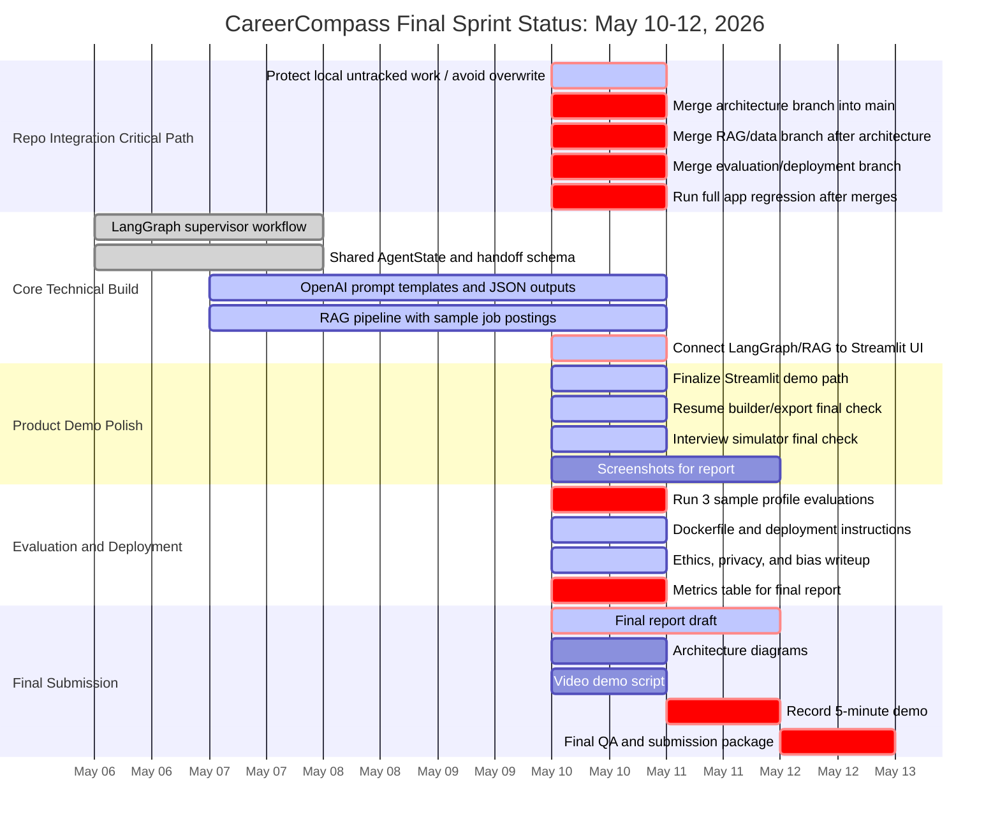

# CareerCompass Gantt Status - May 10, 2026

Today is **May 10, 2026**. The project is no longer in early setup mode; it is in the integration, evaluation, demo, and submission packaging window.

Important repo note: `origin/main` is still behind the feature branches. The core work appears to exist on branches, but the current critical path is merging and validating the branches without overwriting each other.

## Current Sprint Gantt



## Where We Are Right Now

| Area | Original Due Date | Current Status | Notes |
| --- | --- | --- | --- |
| Group meeting and role lock-in | May 6 | Mostly done | Carlo and Nhi are claimed; TM3/TM4/TM5 remain available but lanes are documented. |
| GitHub repo setup and branch rules | May 6 | Mostly done | Branch/SOP docs exist. Main issue is that `main` is behind active branches. |
| LangGraph supervisor workflow | May 6-7 | Done on branch | Architecture branch has workflow/state/handoff work. Needs merge into `main`. |
| Shared AgentState and handoff schema | May 6-7 | Done on branch | Same as above. |
| OpenAI prompt templates | May 7-8 | In progress | Prompt/schema/fallback structure exists, but TM3 lane still needs final polish and validation. |
| RAG pipeline with sample postings | May 7-9 | In progress | RAG branches exist. Need integration into main workflow and UI evidence display. |
| Connect LangGraph/RAG to Streamlit | May 9-10 | Critical today | This is the major May 10 integration task. |
| Finalize Streamlit demo path | May 8-10 | In progress | App exists. Needs post-merge walkthrough and screenshot pass. |
| Resume builder/export final check | May 9-10 | In progress | Feature exists. Needs final QA after merge. |
| Interview simulator final check | May 9-10 | In progress | Feature exists. Needs final QA after merge. |
| Run 3 sample profile evaluations | May 9-10 | Critical today | Evaluation docs exist, but the actual 3-profile run still needs to be captured. |
| Dockerfile and deployment instructions | May 9-10 | Done on branch | TM5 branch has Docker/deployment artifacts. Needs merge and smoke test. |
| Ethics/privacy/bias writeup | May 10-11 | In progress | TM5 branch appears to include ethics docs. Needs final report integration. |
| Final report draft | May 9-11 | Critical today/tomorrow | Start consolidating now using screenshots, metrics, ethics, architecture. |
| Architecture diagrams/screenshots | May 10-11 | Due now | Diagrams can be generated from workflow docs; screenshots need final merged app. |
| Video demo script | May 10 | Due today | Demo script doc exists, but should be aligned to final app after merge. |
| Record 5-minute demo | May 11 | Tomorrow | Do not record before merge/regression unless absolutely necessary. |
| Final QA and submission package | May 12 | Final day | Needs merged repo, Docker package, report, and video. |

## Current Critical Path

1. Preserve local work so the pull/merge does not overwrite untracked files.
2. Merge architecture branch first.
3. Merge RAG/data branch second.
4. Merge TM5 evaluation/deployment branch third.
5. Run the app locally and fix integration breaks.
6. Run 3 sample evaluations and capture results.
7. Take screenshots and finalize report figures.
8. Record the 5-minute demo on May 11.
9. Package and submit on May 12.

## Role Focus For May 10

### Carlo / Architect

- Own merge order and integration.
- Resolve shared file conflicts.
- Confirm supervisor, state, RAG, and Streamlit work together.
- Keep the final narrative tight.

### Nhi / RAG/Data

- Confirm retrieved evidence works for the demo role/location.
- Add or verify sample job postings.
- Document retrieval limitations and confidence.

### TM3 / Agent Logic

- Validate prompts, JSON outputs, and fallback behavior.
- Check weak outputs after evaluation runs.
- Make sure outputs remain stable for the demo scenario.

### TM4 / Frontend/Demo

- Final Streamlit walkthrough.
- Capture screenshots.
- Confirm resume and interview tabs work smoothly.
- Help align video script to the actual UI.

### TM5 / Evaluation/Deployment

- Run or document 3 sample profile evaluations.
- Confirm Docker instructions.
- Finalize ethics/privacy/bias notes.
- Help populate metrics table for the report.

## Simple May 10 Checkpoint Message

Send this to the team:

```text
Today is integration day. Main is behind the feature branches, so please do not push directly to main. We need to merge architecture first, RAG second, and eval/deploy third. After that we run the app, capture the 3-profile evaluation table, take screenshots, and lock the demo script for recording tomorrow.
```

## Risk Level

Current risk: **Medium-high**, but manageable.

The project functionality appears close. The risk is not lack of code; the risk is integration timing, unmerged branches, and final packaging.

If the team focuses only on merge/integration/evaluation/report from here, the May 12 deadline is still realistic.
